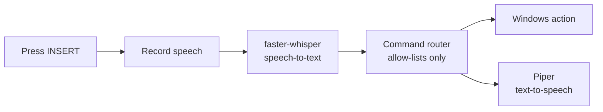

# NEXA


**NEXA is a lightweight, local-first voice assistant for Windows, written in Python.**
It listens for a spoken command, works out what you want, performs an approved action on your PC,
and answers out loud, all on your own machine with no cloud backend and no API keys.



## Features

- **Hands-free control**: press `Insert`, speak, and NEXA does the rest.
- **Local speech recognition** with [faster-whisper](https://github.com/SYSTRAN/faster-whisper) (`tiny` model by default).
- **Natural local voice** with [Piper](https://github.com/OHF-Voice/piper1-gpl) text-to-speech.
- **Launch apps, websites, folders and Windows Settings pages** from a configurable allow-list.
- **System info**: CPU, RAM, storage, battery and network status.
- **Time and date**, a little conversation, and a built-in "what can you do?".
- **Silent mode**: keep listening, stop talking.
- **Confirmation for sensitive actions** (lock, and optionally shutdown/restart).
- **Safe by design**: spoken text is matched against allow-lists, never executed as a shell command.

## Requirements

- Windows 10 or 11
- Python 3.10 or newer
- A working microphone and speakers
- Internet **once** on first run (to fetch the Piper voice and the Whisper `tiny` model); offline afterwards

## Quick start

```powershell
# 1. Get the code
git clone https://github.com/srishti233/NEXA.git
cd NEXA

# 2. Create and activate a virtual environment
python -m venv .venv
.venv\Scripts\Activate.ps1

# 3. Install dependencies
pip install -r requirements.txt

# 4. Download the Piper voice (~64 MB, saved to ./models)
python scripts/download_model.py

# 5. (Optional) find your microphone and set it, see Configuration
python scripts/list_audio_devices.py

# 6. Run
python main.py
```

Press **Insert** to wake NEXA, say a command, and she answers. Press **Ctrl+C** to quit.
The first launch also downloads the Whisper `tiny` model (~75 MB) and may take a moment.

> If Insert isn't detected, try starting the terminal as Administrator. The
> [`keyboard`](https://github.com/boppreh/keyboard) library installs a global hook.

## Example commands

| Say | What happens |
| --- | --- |
| "Open Chrome" / "Open PyCharm" / "Open VS Code" | Launches the app |
| "Open File Explorer" / "Open my downloads" | Opens the folder or Explorer |
| "Open Settings" / "Open Bluetooth settings" | Opens that Windows Settings page |
| "Open the search bar" | Presses Win+S |
| "Open YouTube" / "Open GitHub" | Opens the site in your browser |
| "What is my RAM usage?" / "What is my CPU usage?" | Reads out the figure |
| "What is my storage?" / "How is my battery?" / "Am I online?" | Reads out the status |
| "What time is it?" / "What's the date?" | Time and date |
| "Silent mode" / "Speak again" | Mutes / unmutes spoken replies |
| "Lock my computer" | Asks for confirmation first |
| "What can you do?" | Short summary of abilities |

Prefixes like "Hey NEXA" and "please" are ignored.

### Confirmations

Sensitive actions ask first. NEXA replies with the question, then you press **Insert** again and say
**"yes"** (or **"no"**). A pending confirmation expires after 30 seconds
(`CONFIRMATION_TIMEOUT`).

## Configuration

Everything is in [`config.py`](config.py). To change settings **for your machine only**, create a
`config_local.py` next to it (git-ignored); anything defined there overrides `config.py`:

```python
# config_local.py
MICROPHONE_DEVICE_INDEX = 1     # from scripts/list_audio_devices.py
TTS_SPEED = 1.0
```

| Setting | Default | Meaning |
| --- | --- | --- |
| `STT_MODEL` | `"tiny"` | Whisper model size (`tiny`, `base`, `small`, ...). Bigger is more accurate but slower. |
| `STT_TIMEOUT` | `10` | Maximum seconds recorded per command |
| `STT_NO_SPEECH_TIMEOUT` | `5` | Give up if nothing is said within this time |
| `STT_SILENCE_DURATION` | `1.0` | Seconds of silence that end a command |
| `TTS_VOICE` | `"en_US-john-medium"` | Piper voice name (see `scripts/download_model.py`) |
| `TTS_SPEED` | `1.08` | Speech speed (1.0 = normal) |
| `MICROPHONE_DEVICE_INDEX` | `None` | Input device (`None` = system default) |
| `SAMPLE_RATE` | `48000` | Recording rate, which must be supported by your microphone |
| `SILENT_MODE` | `False` | Start without speaking |
| `APPLICATIONS` / `WEBSITES` / `FOLDERS` / `SETTINGS_PAGES` | see file | The allow-lists NEXA can open |
| `ENABLE_*` | `True` | Switch whole feature groups on/off |
| `ALLOW_DESTRUCTIVE_COMMANDS` | `False` | Enables confirmed shutdown / restart |
| `PERSONALITY` | see file | NEXA's canned phrases |

### Adding an application

Add an entry to `APPLICATIONS` in `config.py`: spoken name, launch target, and optional aliases.

```python
APPLICATIONS["obsidian"] = ("obsidian", ())
```

The launch target is anything the Windows `start` command understands (an `.exe` on your PATH, a
registered app name, or a full path). NEXA can **only** launch what is listed here.

## Project structure

```
NEXA/
├── commands/
│   ├── __init__.py
│   └── basic_commands.py     # intent matching + safe actions
├── voice/
│   ├── __init__.py
│   ├── speech_to_text.py     # recorder + faster-whisper
│   └── text_to_speech.py     # Piper
├── scripts/
│   ├── download_model.py     # fetch the Piper voice
│   └── list_audio_devices.py
├── tests/                    # pytest suite
├── models/                   # Piper voice files (not committed)
├── .github/workflows/ci.yml
├── config.py
├── main.py
├── requirements.txt
└── requirements-dev.txt
```

## Safety

- Spoken text is **matched, never executed**. There is no shell passthrough.
- Only applications, sites, folders and settings pages listed in `config.py` can be opened.
- Lock (and shutdown/restart, if you enable them) require a spoken confirmation.
- Shutdown and restart are **disabled** unless `ALLOW_DESTRUCTIVE_COMMANDS = True`.
- Arbitrary shell, administrator and destructive commands are not part of NEXA 0.1.
- Everything runs locally. After the one-time model downloads, no audio or text leaves your PC.

## Troubleshooting

| Problem | Fix |
| --- | --- |
| `Piper voice ... not found` | Run `python scripts/download_model.py` |
| Nothing is heard / wrong microphone | Run `python scripts/list_audio_devices.py`, then set `MICROPHONE_DEVICE_INDEX` |
| `Invalid sample rate` | Set `SAMPLE_RATE` to your device's rate (44100 or 48000) |
| Misheard commands | Try `STT_MODEL = "base"` and speak after the greeting finishes |
| Insert does nothing | Run the terminal as Administrator; check no other app grabs the key |
| Console shows `?` for emoji | Harmless, since your console font lacks them (use Windows Terminal) |

Logs are written to `nexa.log` (rotated at `MAX_LOG_SIZE_MB`).

## Development

```powershell
pip install -r requirements-dev.txt
pytest          # tests run without a microphone, speakers or models
ruff check .
```

CI runs the same checks on Windows for every push and pull request.

## Roadmap

NEXA 0.1 focuses on reliable voice interaction, safe Windows automation and a small local footprint.
Ideas for later: wake-word activation, volume and media control, reminders and timers, and an
optional local LLM for open-ended conversation.

## Credits

[faster-whisper](https://github.com/SYSTRAN/faster-whisper) · [Piper](https://github.com/OHF-Voice/piper1-gpl)
and the [piper-voices](https://huggingface.co/rhasspy/piper-voices) models · sounddevice · psutil · keyboard

## License

MIT, see [LICENSE](LICENSE). The Piper voice is distributed separately under its own licence.
